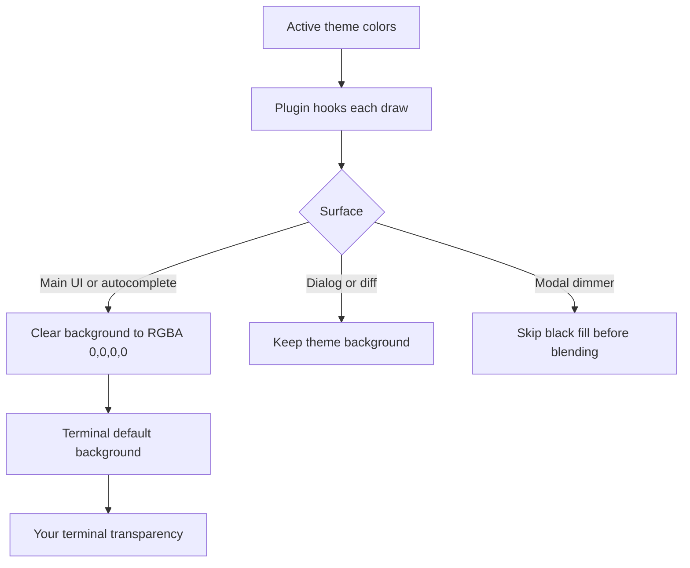

# OpenCode Transparent Background

Make OpenCode transparent with any theme, using your terminal's transparency
through its default background. Text, selected rows, and dialog surfaces keep
their theme colors. No OpenCode source changes are needed.

The plugin follows native clipping and opacity, and restores its hooks on unload.
Transparency strength is controlled by your terminal.

Targets OpenCode V2 `2.0.21` and OpenTUI `0.5.14`; renderer internals can change
between versions.
